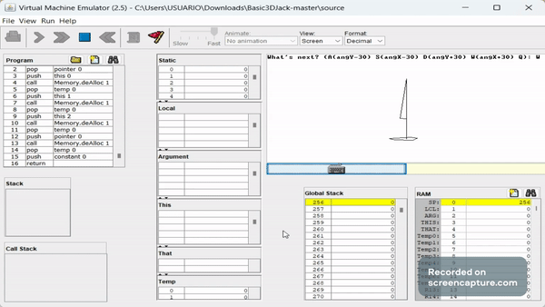

# Basic 3D in Jack (It's damn slow...)

Ok, so... I developed a simple 3D engine for the platform we use in the Nand2tetris course.

I used the library for Floating point arithmetic and trigonometric functions developed by Mark Armbrust, I'm really grateful to him.

# Classes

* Main.jack: It draws a "boat" on the screen wich you can rotate using A S D W.
* Vector3.jack: It's a class for representing tridimensional vectors.
* Matrix44.jack: It's a class for representing 4x4 matrices and generating default transformation matrices used in computer graphics.
* Plotter3.jack: It's a class developed in order to simplify the drawing of the meshes.
* Util.jack: It's a simple utility class.

# Demo

